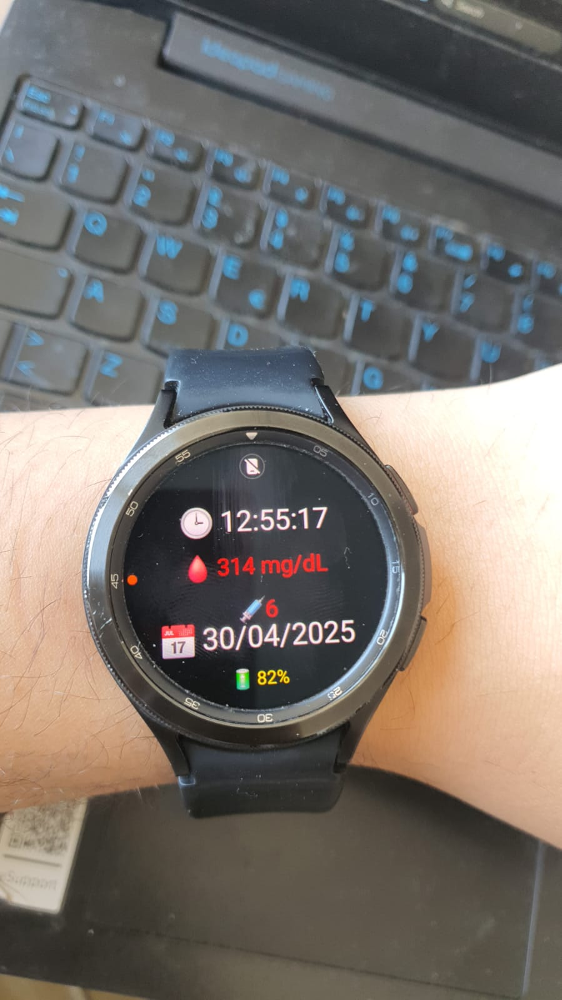

# 📱 DiabetyFace - Glucose Watchface for Wear OS

A custom watch face for Wear OS smartwatches that displays real-time glucose values from Abbott's FreeStyle Libre (via LibreView API), as well as insulin correction recommendations, time, date, and battery level. Emojis are used for intuitive display.


---

## 📦 Features

- ⏱️ Displays current time
- 📅 Shows the date
- 🩸 Displays the latest glucose value (mg/dL)
- 💉 Shows insulin correction needed
- 🔋 Displays the watch's battery level
- ⏲️ Auto-updates every 10 minutes

---

## 🔧 Configuration

### 🔐 LibreView Credentials

To connect to the LibreView API, you must supply your own email and password.

In `MyDiabetyFace.java`, locate the following lines:

```java
credentialsManager = new CredentialsManager("test", "test");
```

**Replace** with your own LibreView email and password:

```java
credentialsManager = new CredentialsManager("your_email@example.com", "your_password");
```

---

### 🔼 Glucose High Threshold

In `GlucoseManager.java`, you’ll find:

```java
private final Integer THRESHOLD_HIGH = 180;
```

This constant defines the glucose level threshold (in mg/dL) above which the watch face will recommend an insulin correction.

- **Default**: `180`
- **To change**: Replace it with a custom threshold suited to your personal glucose target.

**Example:**

```java
private final Integer THRESHOLD_HIGH = 160;
```

This will trigger correction suggestions when your glucose exceeds 160 mg/dL.

---

### ⚖️ Insulin Sensitivity

Still in `GlucoseManager.java`, the insulin sensitivity factor is defined as:

```java
private final Integer SENSIBILITY = 30;
```

This indicates how many mg/dL of glucose are lowered by 1 unit of insulin.

- **Default**: `30`
- **To change**: Replace it with your personal insulin sensitivity factor.

**Example:**

```java
private final Integer SENSIBILITY = 40;
```

This means 1 unit of insulin lowers your glucose by 40 mg/dL.  
The correction formula used is:

```
correction = (current_glucose - CIBLE) / SENSIBILITY
```

Where `CIBLE` (the target glucose level) is hardcoded as 120 mg/dL.

---

### 🔁 Data Update Interval

In `MyDiabetyFace.java`, look for:

```java
private static final long UPDATE_INTERVAL_MS = 600000; // 10 minutes
```

This value defines how frequently the watch face fetches new glucose data from the LibreView API.

- **Default**: `600000` ms (10 minutes)
- **To change**: Adjust the value (in milliseconds).

**Examples:**
- For 5-minute updates:
  ```java
  private static final long UPDATE_INTERVAL_MS = 300000;
  ```
- For 15-minute updates:
  ```java
  private static final long UPDATE_INTERVAL_MS = 900000;
  ```

---

## 🚀 Deploying to a Wear OS Watch

### ✅ Prerequisites
- Android Studio installed
- Wear OS smartwatch with developer mode enabled
- USB or Wi-Fi debugging enabled on the watch

### 🛠️ Build and Run
1. Open the project in Android Studio
2. Connect your smartwatch via USB or wirelessly
3. Select the `wear` module as the build target
4. Click **Run** ▶️ to install and launch the watch face

### 🎨 Watch Face Display
The watch face displays:
- 🕒 Current time
- 📅 Date
- 🩸 Glucose value
- 💉 Insulin correction
- 🔋 Battery level

### 🔐 Notes
- Make sure your watch has internet access for API communication
- No special permissions are needed other than Internet

---

## 👨‍⚕️ Disclaimer
This app is for personal use and **not a certified medical device**. Always consult a medical professional before making any treatment decisions.

---

## 📝 License
This project is distributed for educational and personal health tracking purposes. You are free to modify it at your own risk.

